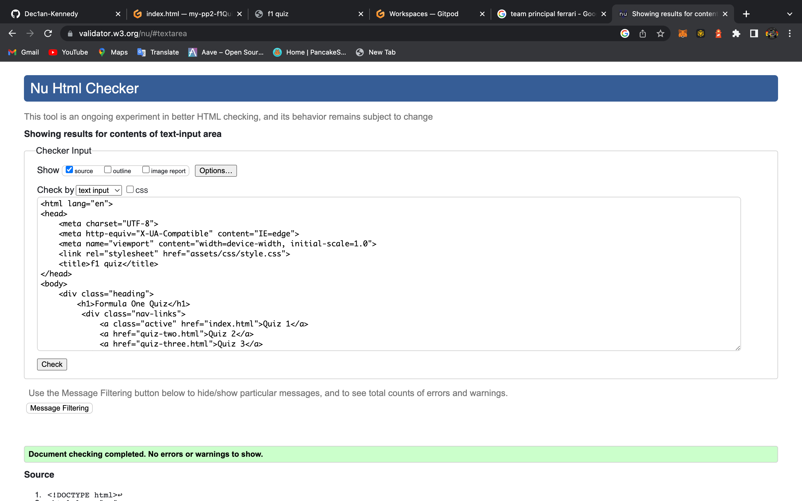
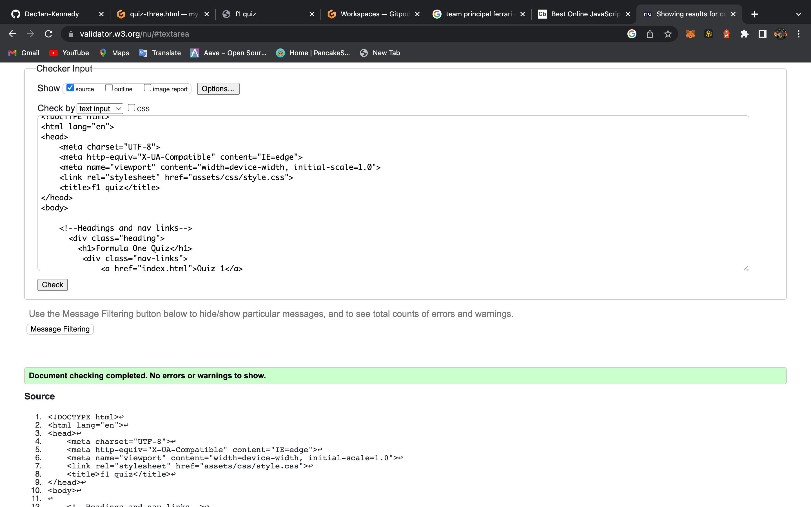
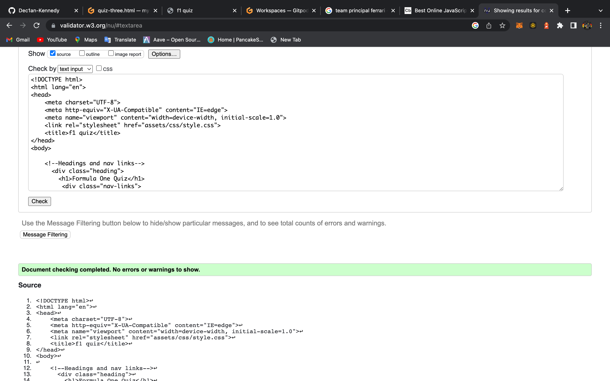
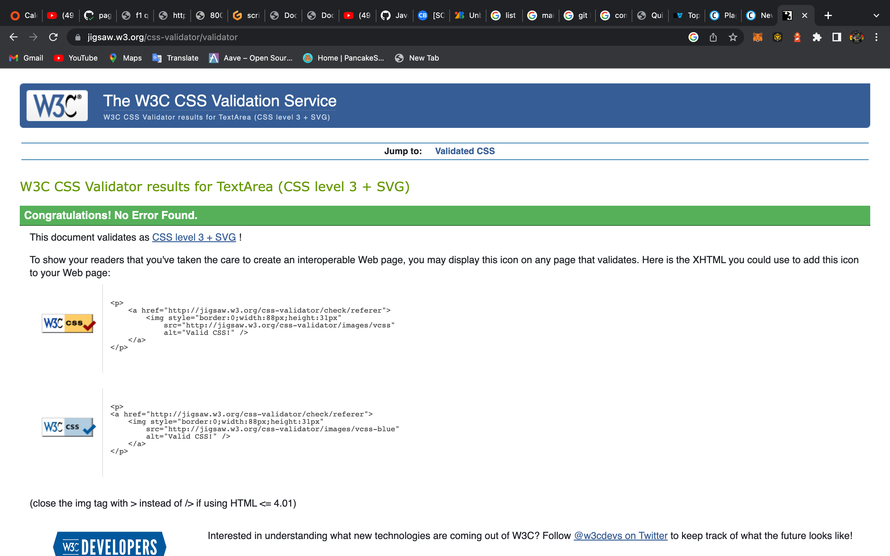
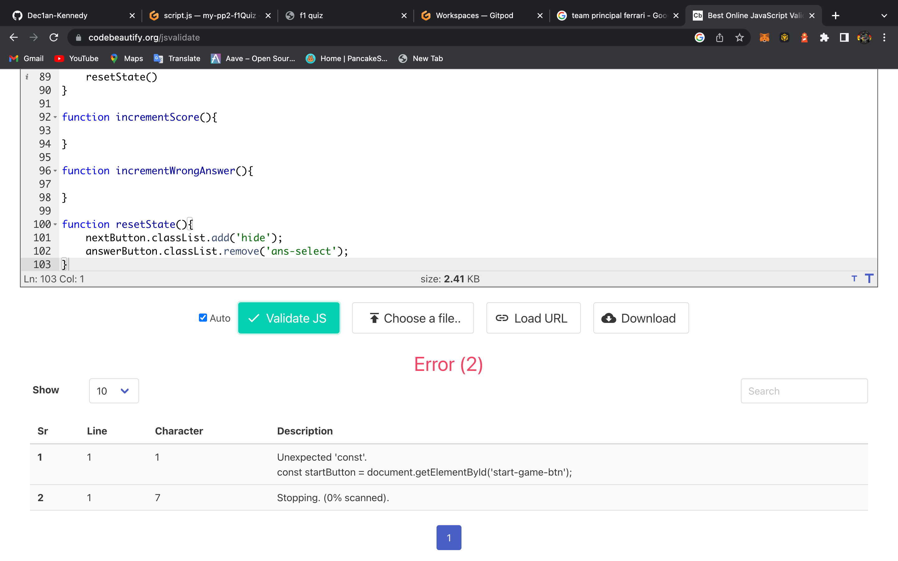
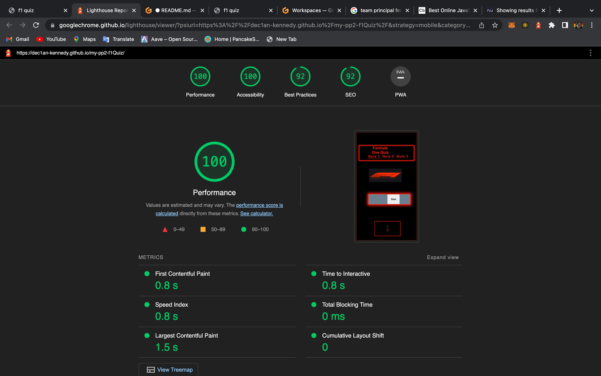
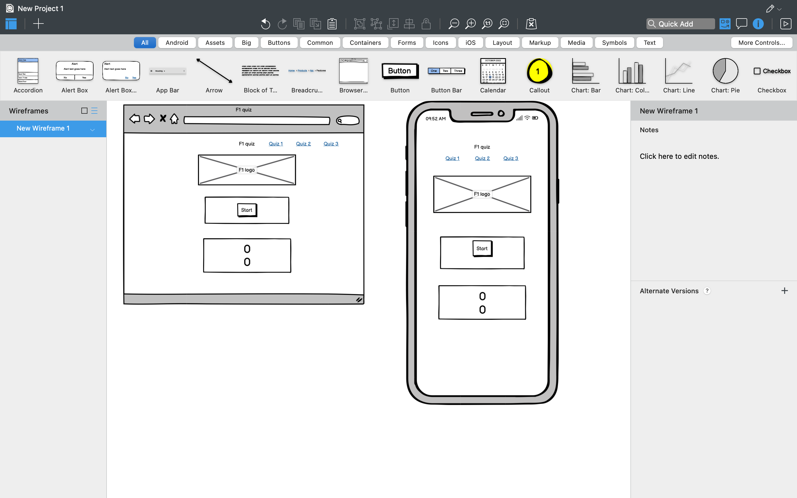
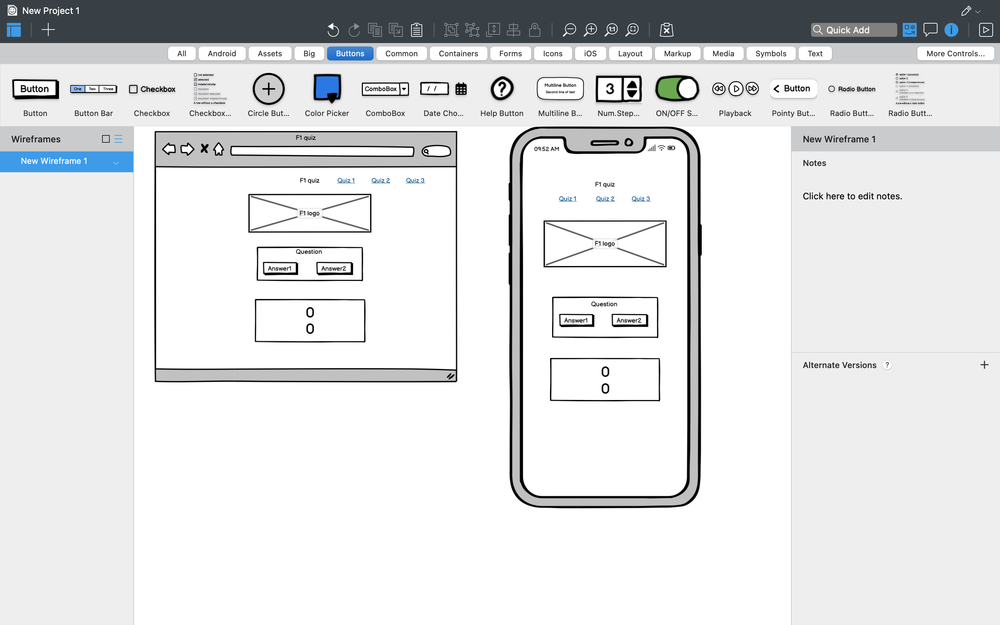

# Formula One Quiz
This formula one quiz has varius different basic questions to test your formula one knowlage.
 

## Features 

In this section, you should go over the different parts of your project, and describe each in a sentence or so. You will need to explain what value each of the features provides for the user, focusing on who this website is for, what it is that they want to achieve and how your project is the best way to help them achieve these things.

### Existing Features

- __Navigation Bar__

  - Featured on all three pages, the full responsive navigation bar includes a link to Quiz 1, Quiz 2 and Quiz 3 page and is identical in each page to allow for easy navigation.
  - This section will allow the user to easily navigate from quiz to quiz across all devices without having to revert back to the previous page via the ‘back’ button. 

![Nav Bar]

- __The quiz__

  - The quiz includes a start button to allow the user to start the game. 
  - The quiz then begains by showing a question and showing 2 possaible answers.
  - Once answer is clicked it will be selected and the next button will appear.
  - After you picked your answer and have clicked next it will submit your answer and load the next question.
![Quiz Features]

### Features Left to Implement

- Another feature idea that I would have liked to implement would be quiz music in the background.
- Shuffled questions would be anoth festure i would implement.

## Testing 

I tested the website reponsivness using four different devices.Those devices are as follows

-Razer Blade 15 laptop
-M1 Macbook pro(standard laptop screen and also displayed up onto a 21 inch monitor)
-Iphone 12 Pro
-Ipad pro

### Validator Testing 

HTML

  

CSS

Javascript

### Lighthouse Testing

### Wireframes
-The wireframes and the finished project have some differences, this is because as i went along i realised i could implement more features and in a neater design. These are the original wireframes

Quiz Start

Quiz Question

### Unfixed Bugs

I ran into difficulty getting the questions to display using javascript, and i also was unable to get the score chart to work.

## Deployment

- The site was deployed to GitHub pages. The steps to deploy are as follows: 
  - In the GitHub repository, navigate to the Settings tab 
  - From the source section drop-down menu, select the Master Branch
  - Once the master branch has been selected, the page will be automatically refreshed with a detailed ribbon display to indicate the successful deployment. 

The live link can be found here - https://dec1an-kennedy.github.io/my-pp2-f1Quiz/ 

## Credits 
- https://www.w3schools.com/
- https://www.youtube.com/watch?v=ZYV6dYtz4HA
- https://www.formula1.com/
- basmaiq wireframes
- Adobe Photoshop
### Content 
- The formula one logo was taken from https://www.formula1.com/

### Media

- images on this page were taken from https://www.formula1.com/
